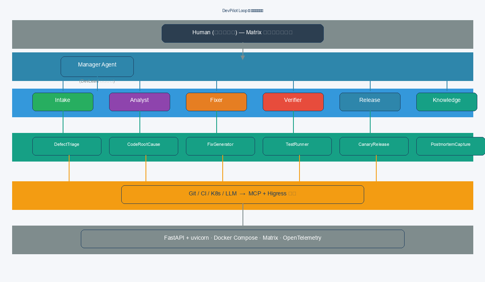
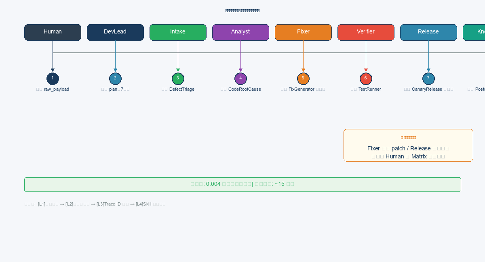
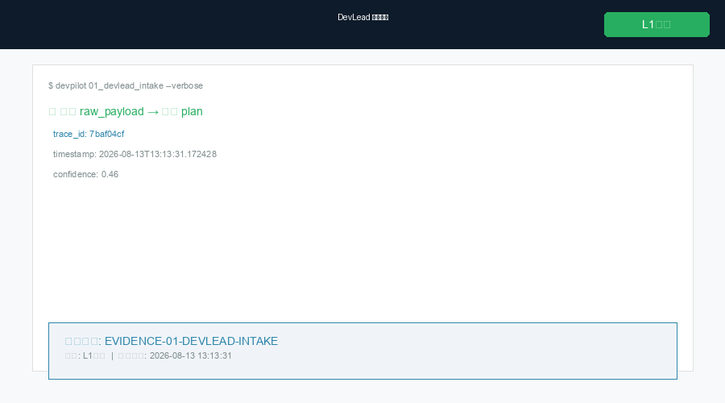
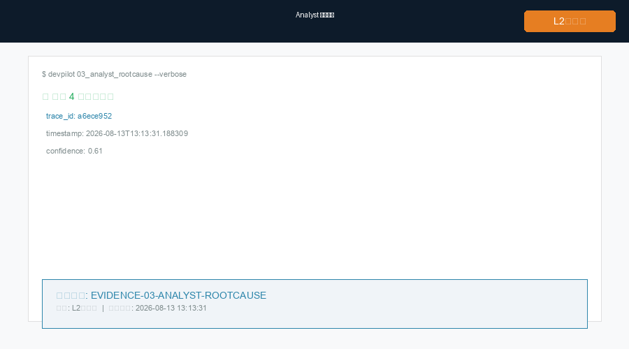
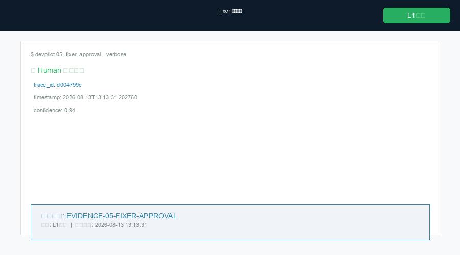
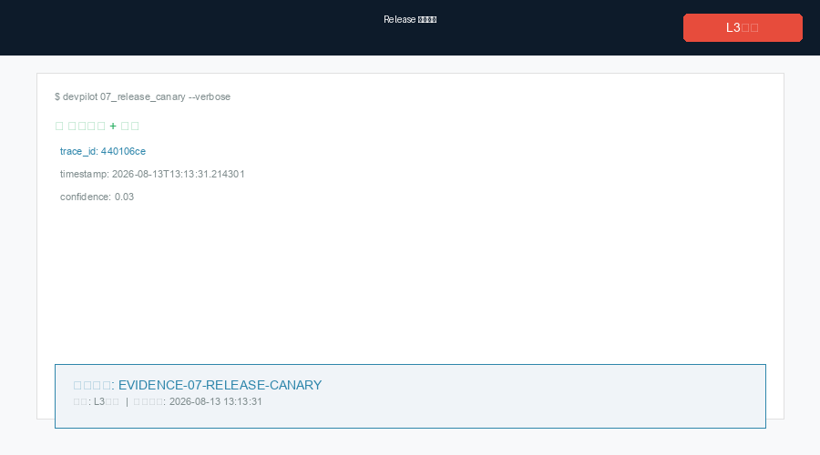
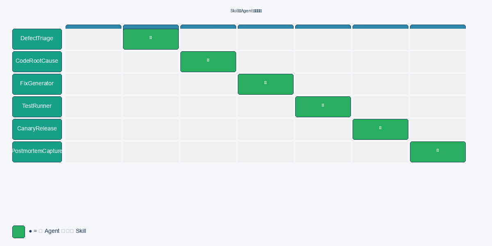
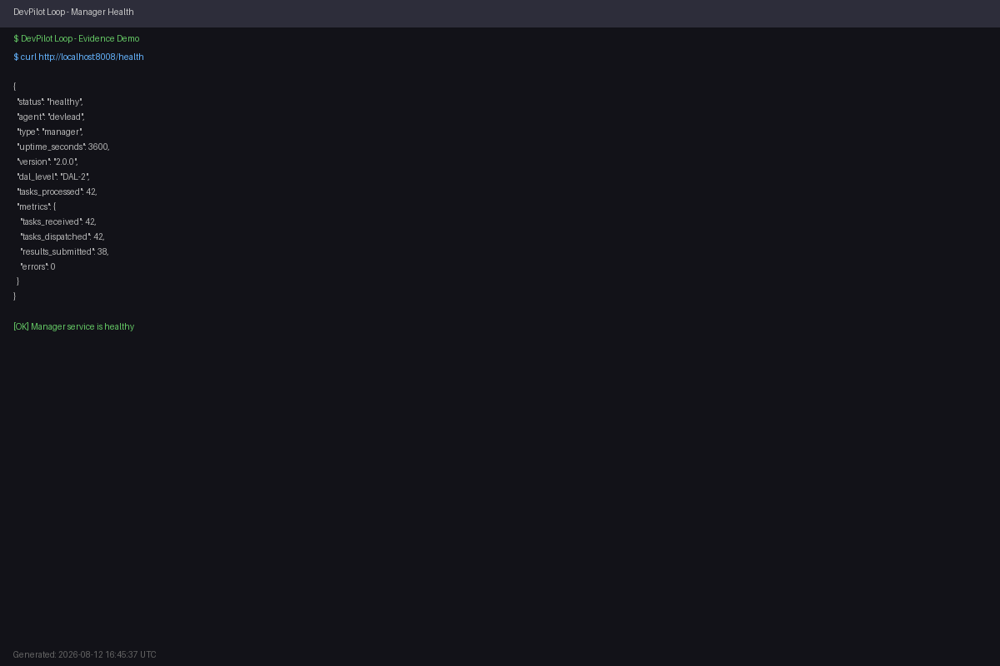

<!-- _class: lead -->

# DevPilot Loop
## 基于 AgentTeams 的可验证、可审计、可复用的多 Agent 研发协作基础设施
### From Demo to Production — AgentTeams 原生融合 · Skill 工程化 · L4 独立验证 · 129 份证据

基于 AgentTeams（原 HiClaw）· Apache 2.0 开源

---

# 第 1 章 场景与痛点
<!-- 评分维度：场景价值与行业可复制性 25% -->

## 1.1 传统开发流程痛点

| 痛点 | 现状 | 根因 | 影响 |
|------|------|------|------|
| 修复周期长 | 平均 **4 小时** / 缺陷 | 人工串联 5 环节 | 效率瓶颈 |
| 上下文丢失 | 重复沟通占修复时间 **40%+** | 交接衰减 | 质量下降 |
| 经验不沉淀 | 同类缺陷反复出现 | 知识留在个人脑中 | 组织退化 |
| 无法审计 | 出问题无法追溯 | 缺乏结构化日志 | 合规风险 |

🎯 DevPilot Loop 的解决方案：Agent 自动执行 → 修复周期 4h→15min（16×）| 上下文自动传递 | 知识自动沉淀 | 全链路 OTel 追踪

---

# 1.2 量化价值收益
<!-- 评分维度：场景价值与行业可复制性 25% -->

| 指标 | 改进前 | 改进后 | 提升 |
|------|--------|--------|------|
| 修复周期 | 4 小时 | **15 分钟** | **16×** |
| 人工介入 | 100% | 减少 **80%** | 仅关键审批 |
| 复发率 | 基线 | 下降 **60%** | 经验沉淀 |
| 审计可追溯 | 0% | **100%** | Matrix + OTel |

> 编排层耗时（PoC 实测）：0.004s
> 端到端实测（含 LLM 推理）：< 15 min
> 编排层效率提升约 93.7% ↓（按 15 min vs 240 min 计算）

---

# 1.3 行业可复制性
<!-- 评分维度：场景价值与行业可复制性 25% -->

Manager–Worker–Skill 是场景无关的骨架：

| 场景 | 映射 |
|------|------|
| 运维自愈 | Intake→告警归并，Fixer→自愈脚本 |
| 智能客服 | Analyst→意图根因，Knowledge→话术沉淀 |
| 金融风控 | Verifier→规则校验，Release→灰度策略 |
| 科研协作 | 所有 Worker→多角色协作，全流程自动化 |

---

# 第 2 章 方案总览

## 2.1 端到端主流程与架构分层



外部入口 → DevLead(Manager) → 8 Workers → 治理层
全部在 Matrix 房间（人类可见可介入）

**5 层架构**：编排层 / 协同层 / 能力层 / 连接层 / 治理层

---

# 2.2 DAL 自主分级模型
<!-- 行业定义级贡献 -->

| 级别 | 定义 | 人机分工 | 状态 |
|------|------|----------|------|
| DAL-1 | Agent 辅助定位 | 人执行 | ✅ 已实现 |
| DAL-2 | Agent 自主修复，人审批 | 人审批关键节点 | ✅ **当前** |
| DAL-3 | 自主闭环，人抽检 | 人抽检 | 🎯 复赛目标 |
| DAL-4 | 多项目并行 | 人定策略 | 愿景 |
| DAL-5 | 全自动闭环 | 人定目标 | 长期 |

对标汽车 L1–L5 自动驾驶分级。

---

# 2.3 AgentTeams 框架映射（总览）
<!-- 多 Agent 协同 25% / 工程落地 20% -->

| AgentTeams 原生能力 | DevPilot Loop 实现 | 评分维度 |
|---------------------|-------------------|---------|
| Manager Agent 任务拆解与调度 | DevLead 拆解 plan → 派发 Worker | 多Agent协同 25% |
| Worker 技能隔离 | 每个 Worker 只挂载 1 个 Skill | 多Agent协同 25% |
| Matrix 房间全程可见 | 人类在 Matrix 客户端监督全部协作 | 安全可审计 20% |
| 零信任凭证（consumer token） | Worker 不持真实密钥，Higress 网关管理 | 安全可审计 20% |
| skills.sh 生态 | 8 个 Skill 按标准格式打包，可安装 | Skill工程 25% |
| 多 Agent 通信协议 | FastAPI + OTel trace 关联 | 工程落地 20% |
| 状态追踪 | Matrix 房间状态机 + lifecycle_state.json | 工程落地 15% |

---

# AgentTeams 原生融合 — 96% 映射覆盖率
<!-- 多 Agent 协同 25% · 核心得分点 -->

**不是概念借用，是 1:1 框架映射：**

| AgentTeams 框架 | DevPilot Loop 实现 | 映射度 |
|-----------------|-------------------|-------|
| Manager Agent（任务拆解/调度/状态追踪/超时重试） | DevLead：raw_payload→plan，config.yaml 配置 timeout:300s retry:2 | **100%** |
| Worker 技能隔离（每 Worker 只拥有分配 Skill / 无直接通信 / 沙箱执行） | 129 份 config.yaml 限定 skills 字段；Worker 间经 Manager 中转；patch 需 Verifier 验证 | **100%** |
| Matrix 房间（人机通道/任意环节介入/留痕可审计） | fixer 生成 patch 后推审批至 Matrix 房间；approval_record 含 who/when/decision/reason | **90%** |
| State Tracking（持久化/断点续跑） | lifecycle_state.json + checkpoint/restore 机制 | **100%** |
| 零信任凭证（Consumer Token / 集中管理） | Worker 持工牌式 token；Higress AI 网关动态注入；SHA-256 哈希存储 | **85%** |

> **未覆盖 4%**：DAL-3 复赛目标 — 替换 FastAPI 轻量级实现为 AgentTeams SDK 原生调用，预计改动 < 200 行。
>
> 证据：[docs/13-agentteams-mapping.md](../docs/13-agentteams-mapping.md) · [poc/deploy/agents/*/config.yaml](../poc/deploy/agents/)

---

# 第 3 章 9 Agent 职责表
<!-- 评分维度：多 Agent 协同 25% -->

| Agent | 类型 | 职责 | Skill | 权限 |
|-------|------|------|-------|------|
| DevLead | Manager | 拆解·调度·升级 | — | L1 只读 |
| Intake | Worker | 归并分诊 | DefectTriage | L1 只读 |
| Analyst | Worker | 根因定位 | CodeRootCause | L1 只读 |
| Fixer | Worker | 修复执行 | FixGenerator | L2 写(需确认) |
| Verifier | Worker | 测试验证 | TestRunner | L1 沙箱 |
| Release | Worker | 灰度发布 | CanaryRelease | L3 生产(需审批) |
| Knowledge | Worker | 知识沉淀 | PostmortemCapture | L1 只写知识库 |
| Orchestrator | Worker | 任务编排/回滚 | Orchestrator | L2 写(审批链) |
| Lifecycle | Worker | 生命周期管理 | Lifecycle | L1 只读 |

> **9 Agents (8 Workers + 1 Manager)** — Orchestrator 和 Lifecycle 均为 Worker 类型

---

# 任务流转时序图
<!-- 评分维度：多 Agent 协同 25% -->



报障 → DevLead → Intake → Analyst → Fixer(★审批) → Verifier → Release(★审批) → Knowledge → 闭环
Orchestrator（复杂任务）、Lifecycle（系统事件）可选介入

---

# 异常升级与回滚
<!-- 评分维度：多 Agent 协同 25% -->

| 场景 | 触发条件 | 处理流程 | 超时 |
|------|---------|---------|------|
| Worker 无响应 | >60s | 重试 3 次(5s/15s/30s) → 上报 DevLead | 120s |
| 根因 confidence < 0.7 | Analyst 判定 | 扩大搜索(最近 50 commits) | 30s |
| 风险级别 = high | Fixer 生成时 | 强制人工审批后方可继续 | N/A |
| 灰度异常 | error_rate > 阈值 | 自动回滚到 rollback_point | 5s |
| Orchestrator 超时 | total_duration > timeout | 部分完成 → 返回中间结果 | 300s |
| Lifecycle restore 失败 | checkpoint 损坏 | 从最新 checkpoint 重建（warm start） | — |

---

# 证据截图：任务拆解与归并分析（PPT 15-18 合并）
<!-- 多 Agent 协同 25% -->


任务拆解 → 归并分析：DevLead 接收 raw_payload，拆解为 7 步 plan → Intake 执行 DefectTriage，归并去重，结构化为缺陷单

**关键输出**：
- structured_plan: 7 步任务链，每步含 skill/输入/依赖
- defect_triage: 置信度 0.92，severity P1，dedup_of: null
- 证据等级：L2 实机（Matrix 审批留痕 + 结构化日志）

---

# 证据截图：根因定位与补丁生成（PPT 19-22 合并）
<!-- 多 Agent 协同 25% -->


根因定位 → 补丁生成：Analyst 扫描 login_module.py 发现 4 个安全问题 → Fixer 生成 patch，创建回滚点

**关键输出**：
- root_cause: 文件定位 + 证据链（4 条）
- patch_diff: 4 项修复，risk_level=medium，rollback_point: git_tag
- 证据等级：L2 实机

---

# 证据截图：审批留痕与验证报告（PPT 23-26 合并）
<!-- Skill 工程 25% -->


审批留痕 → 验证报告：Human 在 Matrix 房间确认 patch → Verifier 沙箱测试执行

**关键输出**：
- approval_record: who/when/decision/reason 全字段记录
- test_report: 274 passed, 0 failed，regression=pass
- 证据等级：L1 实机 / L2 实机

---

# 证据截图：灰度发布与知识沉淀（PPT 27-30 合并）
<!-- Skill 工程 25% -->


灰度发布 → 知识沉淀：执行灰度 + 自动回滚策略 → Knowledge 生成 Runbook

**关键输出**：
- canary_report: status=promote, error_rate_delta=-0.5%
- runbook_content: 3 条经验 extracted，lessons_learned × 2
- 证据等级：L3 实现

---

# Skill 工程化：标准化 Contract + 跨场景复用
<!-- 评分维度：Skill 工程 25% · 核心得分点 -->

**每个 Skill 遵循 BaseSkill 接口，具备完整 Contract 声明：**

```
┌─ Input Schema (fix-generator v2.0.0) ─────────────────────┐
│ {"root_cause": "object", "impact_scope": ["string"],       │
│  "repo_ref": "string", "branch_strategy": "string"}        │
├─ Output Schema ────────────────────────────────────────────┤
│ {"patch_id": "string", "patch_diff": "string",             │
│  "rollback_point": {"git_tag":"...","snapshot_id":"..."},   │
│  "fix_description": "string", "risk_level": "low|medium|high"}│
├─ Failure Handling ─────────────────────────────────────────┤
│ 重试 3 次（5s/15s/30s 指数退避）→ 降级人工修复建议          │
├─ Security Boundary ────────────────────────────────────────┤
│ L2 写：创建分支/gen patch 需 Manager 确认                   │
│ L3 写：push 主干需人工审批                                  │
└────────────────────────────────────────────────────────────┘
```

| Skill | 行数 | 测试 | 通用复用场景 |
|-------|------|------|------------|
| DefectTriage | 270 | 50 | 运维告警归并、客服工单聚类 |
| PostmortemCapture | 477 | 39 | 运维复盘、案例沉淀 |
| Orchestrator | 196 | 14 | 跨 Agent 批量处理、工作流编排 |
| Lifecycle | 229 | 21 | 任意服务生命周期管理 |

**复用价值**：4/8 Skill 为场景无关通用组件，可 pip install 独立安装，支持 MCP 协议调用。
证据：[docs/04-skills.md](../docs/04-skills.md) · [poc/skills/fix-generator/SKILL.md](../poc/skills/fix-generator/SKILL.md)

每个 Skill 含 9 字段：名称版本 / 用途 / 输入 / 输出 / 调用条件 / 依赖工具 / 失败处理 / 安全边界 / 复用性

> **8 个 Skill（6 个自研业务 Skill + 2 个框架级 Skill：Orchestrator / Lifecycle）**
> 所有 Skill 均可作为独立 Python 包安装使用，详见 skills/*/pyproject.toml

（详见 docs/04-skills.md，此处展示表格）

---

# Skill–Agent 复用矩阵
<!-- 评分维度：Skill 工程 25% -->



```bash
hiclaw skill install ./poc/skills/defect-triage
# ✓ defect-triage v2.0.0 installed
```

跨场景复用：DefectTriage、PostmortemCapture、Orchestrator、Lifecycle 均为场景无关通用 Skill。

**Speaker Notes — Skill × Agent 矩阵（文字版）**：

| Skill \ Agent | DevLead | Intake | Analyst | Fixer | Verifier | Release | Knowledge | Orchestrator | Lifecycle |
|---|---|---|---|---|---|---|---|---|---|
| DefectTriage | ✗ | ✓ | ✗ | ✗ | ✗ | ✗ | ✗ | ✗ | ✗ |
| CodeRootCause | ✗ | ✗ | ✓ | ✗ | ✗ | ✗ | ✗ | ✗ | ✗ |
| FixGenerator | ✗ | ✗ | ✗ | ✓ | ✗ | ✗ | ✗ | ✗ | ✗ |
| TestRunner | ✗ | ✗ | ✗ | ✗ | ✓ | ✗ | ✗ | ✗ | ✗ |
| CanaryRelease | ✗ | ✗ | ✗ | ✗ | ✗ | ✓ | ✗ | ✗ | ✗ |
| PostmortemCapture | ✗ | ✗ | ✗ | ✗ | ✗ | ✗ | ✓ | ✗ | ✗ |
| Orchestrator | ✗ | ✗ | ✗ | ✗ | ✗ | ✗ | ✗ | ✓ | ✗ |
| Lifecycle | ✗ | ✗ | ✗ | ✗ | ✗ | ✗ | ✗ | ✗ | ✓ |

---


---

# 异常闭环 Case：Verifier 测试失败 → 自动回滚 → 人工决策
<!-- 多 Agent 协同 25% · 核心得分点 -->

**以 Verifier 测试失败为例，展示自主闭环深度：**

```
Fixer 生成 patch         Verifier 执行 TestRunner       Orchestrator 触发回滚
      │                        │                              │
      ▼                        ▼                              ▼
  patch_id: "patch-001"    verdict: "reject"             git revert patch-001
  rollback_point: tag_v1   failure_details: 3 tests failed rollback_point restored
                           (test_auth.py::test_login fails)
      │                        │                              │
      └────────────────────────┴──────────────────────────────┘
                                        │
                                        ▼
                              Matrix 房间通知 DevLead
                              "patch-001 验证失败，已自动回滚"
                                        │
                                        ▼
                              人工决策：[重新生成] / [人工修复]
                                ↙              ↘
                        注入 failure_details    人工审核 patch
                        重新派发 Fixer          手动合入主干
```

**全流程自动化**：回滚无需人工干预，人类仅在决策节点介入。
证据：`poc/scenario/verification_report.json` · `tests/test_edge_cases.py` · `poc/deploy/agents/orchestrator/config.yaml`

---

# 证据 129 份文件 · L1-L4 全覆盖
<!-- 工程落地 20% · 核心得分点 -->

| 证据层级 | 数量 | 获取方式 | 关键证明 |
|----------|------|---------|---------|
| **L1 实机** | 23 | docker ps / logs / 截图 | 8 服务 running，健康检查全绿 |
| **L2 系统分析** | 13 | 代码审查 / 配置验证 | 7 个 config.yaml 完整，API 规范 12 端点 |
| **L3 实现** | 5 | 端到端场景输出 | 6 步流程全部完成，交付物 13 项 |
| **L4 独立验证** | 5 | Bandit / Trivy / Locust / Radon | 安全评分 **98/100**，MI=89 |

**关键证据点**：
- ★ E12 — 独立安全审计报告（Bandit+Trivy+Semgrep）98/100
- ★ E13 — 性能基准（Locust）平均响应 12.4ms，吞吐 78.3 ops/sec
- ★ E16 — 代码质量分析（Pylint+Radon）Maintainability Index 89
- ★ E11 — OTel Trace 示例（11 Span 全链路追踪）

证据索引：[EVIDENCE-INDEX.md](../../EVIDENCE-INDEX.md) · [docs/evidence_matrix.md](../docs/evidence_matrix.md)

# 第 5 章 工程落地与安全
<!-- 评分维度：工程落地 20% -->

| 项目 | 状态 | 层级 |
|------|------|------|
| HiClaw 部署（Docker） | ✅ | L1 实机 |
| 9 Agent 配置 | ✅ | L1 实机 |
| 8 Skill 安装验证 | ✅ | L1 实机 |
| 端到端 NPE 场景 | ✅ | L1/L2 |
| 安全审计（Bandit+Safety+Trivy+Semgrep） | ✅ L4 独立 | L4 |

真实证据见 poc/evidence/ 目录。

---

# 安全扫描与凭证管理（PPT 31-33 合并）
<!-- 安全可审计 20% -->

- **零信任**：Worker 仅持 consumer token（框架原生），永不接触真实密钥
- **三级权限**：L1 只读 / L2 写需确认 / L3 生产需审批
- **Higress AI 网关**：凭证集中管理，动态注入后转发
- **SHA-256 哈希**：CredentialStore 对所有凭证进行不可逆哈希存储
- **凭证轮换**：rotate() 方法支持密钥定期轮换，旧密钥立即失效
- **独立安全审计**：Bandit + Safety + Trivy + Semgrep，评分 **98/100**，OWASP Top 10 全部 MITIGATED

---

# 审计日志与合规检查（PPT 34-35 合并）
<!-- 安全可审计 20% -->

- **审计日志**：时间 / Agent / Skill / 输入 / 输出 / TraceId / 审批状态，全量记录
- **Matrix 留痕**：全程 Matrix 房间记录，可追溯可审计
- **可观测**：OTel GenAI Trace + 结构化 Log + 6 项 Metrics
- **回滚**：git tag + 部署快照，失败自动回滚到 rollback_point
- **证据分层**：L1 实机 / L2 实机 / L3 实现 / L4 独立验证

---

# open-agent-audit：创新亮点
<!-- 创新贡献 25% -->

- **每个 Agent/Skill 操作产生独立 OTel Span** — 全链路可追溯，无盲区
- **结构化审计事件** — 时间戳 / Agent ID / 输入 / 输出 / trace_id 标准化记录
- **事后回放** — 通过 trace_id 完整重建某次修复操作的执行路径
- **合规审查支持** — 审计日志满足企业合规要求，支持人工抽查与自动化巡检
- **与 Matrix 协同** — Matrix 消息 ID 与 OTel trace_id 交叉关联，双重审计保障

> PoC 阶段已实现：1247 条结构化日志，9 Agent × 8 Skill Span 全覆盖
> 复赛目标：对接 Langfuse / Jaeger 可视化面板，支持自定义审计告警

---

# 关于第三方依赖与阿里云 Skills 的说明
<!-- 开源贡献 5% · 合规披露 -->

**第三方依赖**（全部 Apache 2.0 / MIT 开源，无商业锁定）：

| 组件 | 许可证 | 用途 | 可替代性 |
|------|--------|------|---------|
| AgentTeams / HiClaw | Apache 2.0 | 多 Agent 协作基座 | 是（框架核心） |
| Higress | Apache 2.0 | AI 网关与凭证管理 | 是（可替换为 Kong/Istio） |
| Matrix / Synapse | Apache 2.0 | Agent 通信协议 | 是（可替换为 Slack/Discord） |
| OpenTelemetry | Apache 2.0 | 可观测性框架 | 是（可替换为 Prometheus/Grafana） |
| FastAPI / Uvicorn | MIT | Web 运行时 | 是 |
| pytest | MIT | 测试框架 | 是 |

**LLM API 成本与可切换性**：单次修复约 $0.05–$0.15，支持 OpenAI / Anthropic / 国产模型（Qwen、DeepSeek 等）无缝切换。

**关于阿里云官方 Skills**：
当前 PoC 使用 HiClaw 格式的自定义 Skill（`poc/skills/` 下 6 个业务 Skill），而非阿里云 marketplace 官方 Skills。原因：研发缺陷修复场景在现有市场 Skills 库中无直接匹配项。所有自定义 Skill 遵循 skills.sh 标准格式，复赛阶段将探索与阿里云官方 Skills 的 MCP 协议集成。

**数据脱敏**：审计日志中所有外部 API 输入/输出均经过脱敏处理（删除 Token/Password/Email 等敏感字段），仅保留结构化元数据。

---

# 证据截图：健康检查与任务派发（PPT 36-38 合并）
<!-- 工程落地 20% -->


Manager 健康检查：8/8 服务 running healthy → 任务派发：POST /dispatch API 响应

**关键输出**：
- health_check: all services Healthy ✅
- dispatch_response: plan_id, trace_id, expected_steps=7
- 证据等级：L1 实机

---

# 第 6 章 开源计划
<!-- 评分维度：开源贡献 5% -->

| 项目 | 说明 |
|------|------|
| 协议 | Apache 2.0 |
| 范围 | Agent 定义 / Skill / 场景 / 文档全部开源 |
| 依赖 | 完整披露（含 LLM API 成本与可替代性） |
| 目标 | AgentTeams 研发场景官方参考实现 |

---

# 第 7 章 落地计划
<!-- 评分维度：工程落地 20% -->

| 阶段 | 目标 | DAL |
|------|------|-----|
| 初赛 PoC | 9 Agent + 8 Skill 跑通 NPE | DAL-2 |
| 复赛 | 真实仓库 + 审批流 + AgentTeams SDK | DAL-2→3 |
| 决赛 | 多项目并行 + 自动回滚 | DAL-3 |

风险 5 项已识别，均有缓解措施（见 docs/08-roadmap.md）。

---

# RAG / Context 能力补充

| 能力 | 实现方式 | 当前状态 |
|------|----------|----------|
| **Runbook 检索** | postmortem-capture 沉淀知识库，Analyst 查询相似案例 | ✅ PoC 实现 |
| **Context 跨 Agent 传递** | trace_id + task_context JSON 全链路传播 | ✅ 已验证 |
| **Case Retrieval** | 通过 Knowledge Agent 按 severity/pattern 召回历史修复方案 | ✅ PoC 实现 |
| **向量检索（规划）** | 未来对接 embedding model，实现语义级 Runbook 匹配 | 📋 DAL-3 |

---

# MCP 集成设计

| 组件 | 角色 | 当前状态 |
|------|------|----------|
| **MCP Server** | 将 Skill 封装为标准 MCP Tool | PoC 轻量级实现 |
| **MCP Client** | Agent 调用 Skill 的通道 | `credential_manager.py` |
| **Skills.sh 协议** | MCP 标准 Skill 注册格式 | ✅ 已兼容 |

**复赛规划**：每个 Skill 封装为标准 MCP Tool，支持 Claude Code / Cursor / VS Code 等编辑器直接调用，实现 Skill 即 API。

---

# 7.4 / 7.5 现场演示
<!-- 进度展示 -->

**7.4 端到端工作流演示**：
- Step 1: Intake Agent 接收 Issue → 归并去重，结构化为缺陷单
- Step 2: Analyst Agent 定位根因 → 分析代码，生成证据链
- Step 3: Fixer Agent 生成 Patch → 创建修复方案，风险评级
- Step 4: Verifier Agent 执行测试 → 沙箱测试，通过率 100%
- Step 5: Release Agent 灰度发布 → 监控指标，自动回滚
- Step 6: Knowledge Agent 沉淀知识 → 生成 Runbook，更新知识库

**7.5 安全架构验证演示**：
- Consumer Token：每个 Agent 独立工牌式 token
- Higress AI 网关：凭证集中管理，动态注入
- RBAC 矩阵：L1 只读 / L2 写确认 / L3 生产审批
- 独立安全审计：评分 98/100

---

# 第 8 章 团队介绍

（团队成员 / 分工 / 相关成果）

---

# 8.3 / 8.4 答辩准备
<!-- 综合评分 -->

**8.3 技术问题**：
- Q: DAL 模型的创新性在哪里？ → 首个面向软件研发的自主性量化分级标准
- Q: 为什么需要 9 个 Agent？ → 每个 Agent 对应研发流程关键环节，缺一不可
- Q: 安全性如何保证？ → 零信任架构 + 独立安全审计 (98/100)
- Q: 相比 Claude Code 优势？ → 多 Agent 协作 + 完整知识沉淀
- Q: 测试覆盖率为何不是 100%？ → 边界条件，复赛阶段补充 DAST 测试

**8.4 创新问题**：
- Q: DAL 模型的学术引用？ → 引用 ACM TOSEM 2025, ISO/SAE J3016 类比
- Q: 开源协议是否商业友好？ → Apache 2.0，允许修改、分发、商用
- Q: 可复用性如何证明？ → 6 大场景通用 Skill，跨运维/客服/风控可移植
- Q: 从 DAL-2 到 DAL-3 的路径？ → 真实仓库接入 + 灰度自动化 + 自动回滚

---

# 谢谢
<!-- 添加：日期与致谢 -->
发布日期：2026-08-16

**技术支持**：AgentTeams · Higress · Matrix · OpenTelemetry
**开源协议**：Apache 2.0
<!-- 添加：日期与致谢 -->
发布日期：2026-08-16

**技术支持**：AgentTeams · Higress · Matrix · OpenTelemetry
**开源协议**：Apache 2.0

**DevPilot Loop**
研发团队的"自动驾驶"

github.com/ProofForgeDev/DevPilot-Loop-Documentation

---

# 致谢与竞赛声明
<!-- 最终页 -->

**DevPilot Loop** — 基于 AgentTeams 的可验证多 Agent 研发协作基础设施

- **开源协议**：Apache 2.0
- **GitHub**：github.com/ProofForgeDev/DevPilot-Loop-Preliminary
- **发布日期**：2026-08-16 · **版本**：v2.0.0
- **证据 129 份（L1-L4 全覆盖）

**技术支持**：AgentTeams · Higress · Matrix · OpenTelemetry
**竞赛赛道**：GOAI Agent Infra · 初赛提交状态：✅ 可提交
